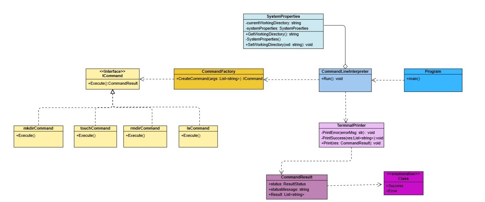

# Custom CLR Shell (C# Implementation)

A Windows command-line interface that mimics Unix/Linux shell commands, implemented in C#.

## Features

- Unix-style commands in Windows environment
- Basic file system operations
- Simple redirection support

## Command Reference

### Navigation
| Command | Description                          |
|---------|--------------------------------------|
| `cd`    | Move to home directory               |
| `cd ~`  | Move to home directory               |
| `cd ..` | Move to parent directory             |
| `pwd`   | Print current directory path         |

### Directory Listing
| Command    | Description                          |
|------------|--------------------------------------|
| `ls`       | List directory contents              |
| `ls -a`    | Show all files (including hidden)    |
| `ls -r`    | List in reverse order                |

### File/Directory Operations
| Command        | Description                          |
|----------------|--------------------------------------|
| `mkdir <dir>`  | Create new directory                 |
| `rmdir <dir>`  | Remove empty directory               |
| `rm <file>`    | Remove file                          |
| `rm -r <dir>`  | Remove directory recursively         |
| `touch <file>` | Create empty file or update timestamp|

### File Contents
| Command                     | Description                          |
|-----------------------------|--------------------------------------|
| `cat <file>`                | Display file contents                |
| `cat file.txt > output.txt` | Overwrite output.txt                 |
| `cat file.txt >> output.txt`| Append to output.txt                 |

### System
| Command | Description                          |
|---------|--------------------------------------|
| `help`  | Show this help                       |
| `exit`  | Exit the shell                       |

## Class Diagram

## Development Details

**Implemented in C# using:**
- `System.IO` for file operations
- `System.Environment` for path resolution
- Custom command parser and dispatcher

